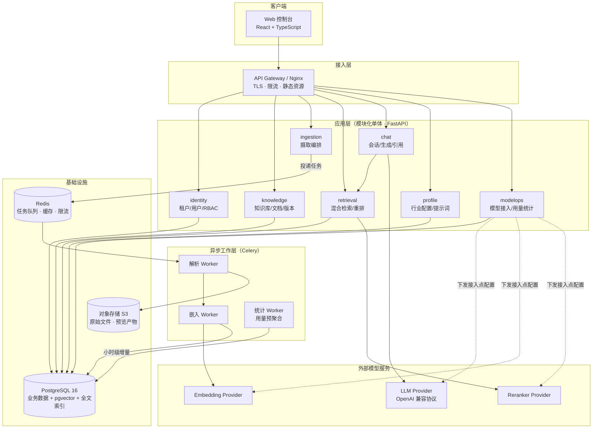
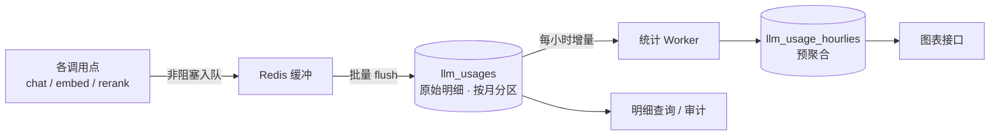
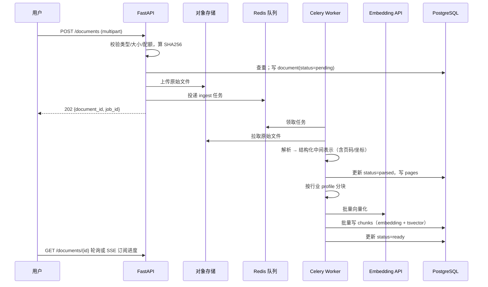
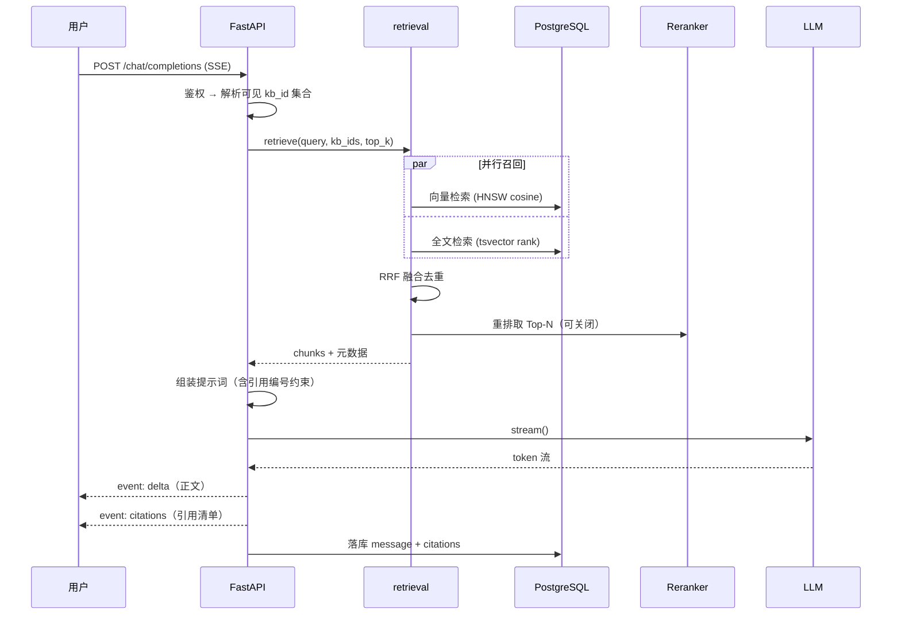

# 01 架构设计

## 1. 背景与目标

工业场景的知识（设备手册、工艺规程、维修工单、安全规范、项目资料）长期以 PDF、Word、Excel 形式散落在共享盘和各业务系统里。检索靠文件名和人脑记忆，新人上手慢，专家经验无法沉淀。通用大模型不了解企业内部资料，直接问会编造。

本平台要解决的核心问题：**让企业内部文档成为可被自然语言检索、且每一句回答都能追溯到原文出处的知识资产**。

### 1.1 产品目标

| 目标 | 可度量的成功标准 |
| --- | --- |
| 问得准 | 内部评测集上 answer 正确率 ≥ 85%，检索 Recall@10 ≥ 90% |
| 敢采信 | 每条回答 100% 带引用，可一键跳转到原文页面并高亮 |
| 不乱编 | 检索不到证据时明确拒答，幻觉率 ≤ 3% |
| 接得住行业差异 | 新增一个行业的接入，只改配置不改代码 |

### 1.2 非目标（首期明确不做）

- 知识图谱构建与图检索
- Agent 工具调用、多步任务编排
- 图纸（CAD/扫描工程图）的视觉理解
- 与 MES/ERP/PLM 等业务系统的实时数据打通
- 模型微调与私有化训练

这些不是不做，而是**必须在基础 RAG 链路的质量被验证之后才做**。它们的设计接缝在本文档中预留，见第 7 节。

## 2. 关键设计约束

| 约束 | 来源 | 对设计的影响 |
| --- | --- | --- |
| 多行业通用，租户可自定义 | 产品定位 | 行业差异必须外化为配置数据，禁止在代码里写 `if industry == "chemical"` |
| 公有云部署，可调用商业 API | 部署决策 | 模型能力通过 Provider 抽象接入，不自建推理集群 |
| 小规模（<10 万页、<50 并发） | 容量预期 | 不引入独立向量库、不引入 Kafka，单库单机起步 |
| 团队规模小、边界未稳定 | 工程现实 | 模块化单体优于微服务 |
| 引用溯源是刚需 | 工业场景合规要求 | chunk 必须携带页码与坐标，贯穿解析、存储、接口、前端 |

## 3. 总体架构



### 3.1 为什么是模块化单体

在 10 万页 / 50 并发的量级下，微服务带来的分布式事务、服务发现、链路追踪、多套部署流水线的成本，远超它带来的收益。真正需要独立伸缩的只有**文档解析**（CPU 密集、耗时长、失败需重试），这一部分已经通过 Celery Worker 拆成独立进程，可以独立扩容。

模块化单体的纪律要求：

- 每个模块是 `app/modules/<name>/` 下的独立包，包含 `router.py`、`service.py`、`repository.py`、`schemas.py`、`models.py`。
- **跨模块只允许调用对方的 `service` 层公开函数，禁止直接 import 对方的 `repository` 或 ORM 模型。** 这是未来能低成本拆服务的唯一保障。
- 模块间的数据库外键允许存在，但跨模块查询必须走 service，不允许在 SQL 里 join 别的模块的表。

## 4. 模块划分

| 模块 | 职责 | 明确不负责 |
| --- | --- | --- |
| `identity` | 租户、用户、成员关系、RBAC、API Key、会话令牌 | 具体资源的授权判定规则（由各模块调用 `identity.authorize` 完成） |
| `knowledge` | 知识库 CRUD、文档元数据、版本管理、文件上传下发 | 文档内容解析 |
| `ingestion` | 摄取任务编排、状态机、失败重试、进度上报 | 具体解析算法（委托 `parsers` 子包） |
| `retrieval` | 多路召回编排（向量 / 全文）、RRF 融合、重排、上下文扩展 | 生成；权限模型的解释（只接收已收窄的 kb_ids） |
| `chat` | 会话与消息、提示词组装、流式生成、引用绑定 | 检索策略 |
| `profile` | 行业模板、分块参数、提示词模板、元数据 schema | 运行时执行 |
| `modelops` | 模型接入点管理、凭证保管、用途路由、健康探测、用量与成本统计 | 实际发起模型调用（由 Provider 实现完成） |
| `platform`（共享层） | 配置、日志、异常、分页、依赖注入、Provider 抽象 | 任何业务逻辑 |

### 4.1 Provider 抽象层

这是整个系统最重要的一层防腐层。业务代码永远不直接 import `openai`。

```python
# app/platform/llm/base.py
class LLMProvider(Protocol):
    async def chat(self, messages: list[Message], **opts) -> ChatResult: ...
    async def stream(self, messages: list[Message], **opts) -> AsyncIterator[Delta]: ...

class EmbeddingProvider(Protocol):
    async def embed(self, texts: list[str], input_type: Literal["query", "document"]) -> list[Vector]: ...
    @property
    def dimension(self) -> int: ...

class RerankProvider(Protocol):
    async def rerank(self, query: str, docs: list[str], top_n: int) -> list[ScoredIndex]: ...
```

带来的收益：换模型只改配置；单元测试用 Fake Provider，不打网络；未来客户要求私有化，实现一个本地 Provider 即可，业务代码零改动。

### 4.2 Retriever 抽象层

与 Provider 抽象平级的第二个关键接口。Provider 抽象的是"外部模型能力"，Retriever 抽象的是"一路召回"，两者共同决定了这个系统能否在不改核心逻辑的前提下演进。

```python
# app/modules/retrieval/base.py
@dataclass(frozen=True)
class RetrievalQuery:
    text: str                       # 已完成指代消解与术语归一的查询
    kb_ids: list[UUID]              # 已收窄为当前用户可见范围
    filters: dict[str, Any]         # 元数据过滤条件
    top_k: int

@dataclass(frozen=True)
class Candidate:
    chunk_id: UUID
    score: float                    # 该路召回的原始分，量纲由各实现自定
    source: str                     # 召回来源标识，透传到 API 的 scores 字段

class Retriever(Protocol):
    name: str                       # "vector" | "fulltext" | "graph" | ...
    async def retrieve(self, q: RetrievalQuery) -> list[Candidate]: ...
```

融合层只面对 `list[Retriever]`，不认识任何具体实现：

```python
async def hybrid_search(retrievers: list[Retriever], q: RetrievalQuery) -> list[Candidate]:
    rank_lists = await asyncio.gather(*(r.retrieve(q) for r in retrievers))
    return rrf_fuse(rank_lists)     # 只用排名，不做跨路归一化
```

首期落地两个实现：`VectorRetriever`（pgvector HNSW 余弦）与 `FulltextRetriever`（tsvector + jieba 分词）。启用哪几路由 `retrieval_rules.retrievers` 配置决定，因此调试时可以单独关掉某一路做 A/B 对比，而不需要改代码。

这个接口约束了三件事，每一件都对应一个已知的演进方向：

- **`Candidate` 只携带 `chunk_id` 和分数，不携带正文**。正文在融合去重后统一批量回表取，避免多路召回重复搬运同一段文本。
- **`score` 的量纲不做统一要求**。这是 RRF 融合的前提——余弦相似度和 `ts_rank_cd` 本就不可比，接口层不去假装它们可比。
- **权限过滤在 `RetrievalQuery` 构造时就已完成**，各 Retriever 拿到的 `kb_ids` 已是安全集合。实现者不需要、也不应该理解权限模型，这样新增一路召回不存在漏掉权限判断的可能。

将来引入图检索只需实现一个 `GraphRetriever` 并注册进配置；把向量检索整体换成独立向量库，也只是替换 `VectorRetriever` 的实现，融合、重排、上下文扩展、生成全部不动。

### 4.3 大模型接入管理（modelops）

4.1 的 Provider 抽象解决的是"**怎么调用**"一个模型，`modelops` 模块解决的是"**调用谁、调得通不通、用了多少、花了多少钱**"。前者是接口，后者是这些接口背后的运营面。两者的分工必须清晰：Provider 实现里不应该出现任何配置查询和统计写入，那会让它无法被单元测试。

#### 4.3.1 接入点模型

一个**接入点（ModelConnection）**是"一个厂商端点 + 一组凭证 + 一个模型标识"的三元组，它是 Provider 实例的配置来源。

```python
# app/modules/modelops/schemas.py
@dataclass
class ModelConnection:
    id: UUID
    scope: Literal["platform", "tenant"]   # 平台统一供给 or 租户自带密钥（BYOK）
    name: str                              # 展示名，如 "主力生成模型"
    provider_type: str                     # openai_compatible | fake | ...
    base_url: str
    credential_ref: str                    # 指向密钥管理服务，不存明文
    model: str                             # 厂商侧模型标识
    purposes: list[Literal["chat", "embedding", "rerank", "title"]]
    priority: int                          # 同用途下越小越优先，用于故障转移
    enabled: bool
    health: Literal["healthy", "degraded", "down", "unknown"]
```

**用途路由**：每次调用先按 `purpose` 查出候选接入点列表（按 `priority` 排序），取第一个健康的构造 Provider。这使得"主力模型挂了自动切备用"成为配置能力而非代码逻辑，直接对应 06 文档风险表里的 R3。

```python
class ProviderFactory:
    async def get(self, purpose: str, tenant_id: UUID) -> LLMProvider: ...
```

工厂内部按 `connection_id + version` 缓存 Provider 实例，配置变更时递增版本号使缓存失效，实现不重启热更新。

**平台级与租户级并存**：`scope="platform"` 的接入点由平台管理员维护、所有租户共用，用量计入各租户配额；`scope="tenant"` 是租户自带密钥，用量只做统计不计费。租户级优先于平台级。

#### 4.3.2 凭证安全

接入点的 API Key **不落业务库明文**，`credential_ref` 指向密钥管理服务中的条目。所有对外接口返回的凭证一律掩码为 `sk-****abc`（保留后 3 位便于人工核对是哪一把钥匙）。密钥的写入是单向的：可以覆盖，不可以读回。这条约束要在接口层强制，不能靠前端自觉。

#### 4.3.3 用量数据链路



三个关键决策：

**埋点必须非阻塞。** 统计写入失败绝不能影响问答本身。调用点只往 Redis 推一条记录，由后台批量 flush 到 `llm_usages`。丢失少量统计数据是可接受的，问答因为写统计失败而报错是不可接受的。

**图表不查原始表，只查预聚合表。** `llm_usages` 按月分区，一个活跃租户一个月轻松几十万行，仪表盘每次刷新都做一次全表聚合会直接拖垮数据库——而仪表盘恰恰是那种用户会一直开着的页面。统计 Worker 每小时增量刷新 `llm_usage_hourlies`（维度：租户 × 模型 × 用途 × 小时），图表查询命中的永远是这张几千行的小表。

**按小时而非按天预聚合。** 多出 24 倍的行数，换来的是时区正确性：预聚合按 UTC 小时存，租户在任何时区都能把小时桶正确重组成"本地时间的一天"。若直接按 UTC 天聚合，东八区用户看到的"7 月 28 日用量"会横跨两个 UTC 日，误差无法修正。

**成本在写入时快照，不在查询时计算。** `model_pricing` 记录单价的生效时间区间，用量入库时就按当时单价算好 `cost_usd` 一并写入。否则厂商一次调价，历史所有月份的成本报表都会跟着漂移，财务对不上账。

#### 4.3.4 可视化设计

仪表盘的图表清单与其回答的问题一一对应，不放"看起来很酷但没人据此做决定"的图：

| 图表 | 类型 | 回答的问题 |
| --- | --- | --- |
| Token 消耗趋势 | 堆叠面积图（prompt / completion 分层） | 用量在涨还是在跌？涨的是输入还是输出？ |
| 成本趋势 | 折线图，叠加本月配额水位线 | 这个月会不会超预算？ |
| 模型分布 | 环形图 | 钱花在哪个模型上？ |
| 用途分布 | 堆叠柱状图（chat / embedding / rerank） | 成本结构是否健康？embedding 占比突增通常意味着有人在批量重建索引 |
| 接入点健康与延迟 | 状态表 + P95 延迟折线 | 哪个接入点在拖慢体验？ |
| 调用成功率 | 折线图，标注熔断事件 | 上游稳不稳？ |
| Top 消耗排行 | 横向条形图（按用户 / 知识库） | 谁在大量消耗？是否异常？ |

交互约定：时间范围支持近 24 小时 / 7 天 / 30 天 / 自定义；粒度随范围自动切换（24 小时→按小时，其余→按天）；所有图表共享同一套筛选条件（时间、模型、用途），切换时只发一次聚合请求，前端按维度拆分渲染，避免七张图打七次接口。

#### 4.3.5 权限

接入点的增删改查限 `owner` / `admin`；平台级接入点仅平台管理员可见可改，租户侧只读且看不到 `base_url` 与凭证。用量数据租户内 `admin` 可看全量，普通成员只能看自己的消耗。所有接入点变更写入 `audit_logs`。

## 5. 核心链路

### 5.1 文档摄取



失败处理：任务状态机为 `pending → parsing → chunking → embedding → ready`，任一阶段失败转 `failed` 并记录 `error_code` 与 `error_detail`。重试从失败阶段开始，不重跑已完成阶段（解析产物落库，避免重复消耗 OCR 与 Embedding 成本）。

### 5.2 问答



关键设计：**引用清单在检索结束后就已确定，先于生成发送给前端**。前端可以立即渲染证据卡片，用户在等待生成的同时就能看到依据来自哪几篇文档。生成完成后再校验模型实际引用的编号，剔除未被引用的条目。

## 6. 技术选型

| 层 | 选型 | 理由 | 被否决的方案及原因 |
| --- | --- | --- | --- |
| Web 框架 | FastAPI | 原生 async，SSE 流式友好，Pydantic v2 校验与 OpenAPI 自动生成 | Django：ORM 与异步生态不匹配流式场景 |
| ORM | SQLAlchemy 2.0 async + Alembic | 类型友好，迁移成熟 | Tortoise/Prisma：生态与 pgvector 集成不足 |
| 主库 | PostgreSQL 16 + pgvector | 向量与业务数据同库，检索时做权限过滤无需跨库；单事务保证一致性 | Milvus/Qdrant：当前量级下多一套有状态组件，且元数据过滤需双写 |
| 全文检索 | PG tsvector + 应用层 jieba 分词 | 云托管 PG 常不允许安装 zhparser 扩展；应用层分词可控且可移植 | Elasticsearch：为 BM25 引入整套集群不划算 |
| 队列 | Celery + Redis | 重试、限流、定时、监控（Flower）开箱即用 | Kafka：量级不匹配；BackgroundTasks：无持久化与重试 |
| 对象存储 | S3 兼容（云上 OSS/S3，本地 MinIO） | 环境一致，通过预签名 URL 直传直下，不经过应用进程 | 存本地磁盘：无法水平扩展且备份困难 |
| 前端 | React 18 + TS + Vite | 生态成熟，PDF 预览与流式渲染有现成方案 | — |
| 数据请求 | TanStack Query | 缓存、轮询、失效策略统一，摄取进度轮询天然适配 | 手写 useEffect：状态管理易失控 |
| UI | Tailwind + shadcn/ui | 组件源码可控，便于按企业 VI 定制 | Antd：定制成本与包体积偏高 |
| PDF 预览 | pdf.js（react-pdf） | 支持按坐标绘制高亮层，是引用溯源落地的前提 | iframe 内嵌：无法控制高亮 |
| 图表 | Recharts | 基于 SVG，声明式 API 与 React 心智一致；用量仪表盘的折线/面积/柱/环形需求它全覆盖 | ECharts：功能过剩且包体积大；D3：这个需求量级下手写成本不划算 |

### 6.1 模型选型（可通过配置切换）

| 用途 | 首选 | 说明 |
| --- | --- | --- |
| Embedding | `bge-m3`（1024 维）或云厂商 text-embedding 服务 | 中文与中英混排表现好，支持 8k 长上下文，工业术语召回优于通用小模型 |
| 生成 | 任一 OpenAI 兼容的强模型 | 需支持 128k 上下文与稳定的结构化输出 |
| 重排 | `bge-reranker-v2-m3` | MVP 默认关闭，作为质量不达标时的第一张牌 |

**向量维度一旦上线不可轻易变更**：`chunks.embedding` 列的维度是 DDL 的一部分，换模型意味着全量重算。因此 `knowledge_bases` 表记录其使用的 embedding 模型标识，切换模型走"新建索引版本 + 后台重建 + 原子切换"流程，见 04 文档。

## 7. 非功能性设计

### 7.1 性能目标

| 指标 | 目标（P95） |
| --- | --- |
| 检索延迟（不含生成） | < 300 ms |
| 问答首 token 延迟 | < 2.5 s |
| 100 页 PDF 端到端摄取 | < 90 s（无 OCR）/ < 5 min（需 OCR） |
| 控制台页面首屏 | < 1.5 s |

### 7.2 安全

- 传输全程 TLS；对象存储仅通过短期预签名 URL 访问，桶禁止公开读。
- 租户隔离采用共享库 + PostgreSQL 行级安全策略（RLS），应用层再做一次显式过滤，双保险。详见 02 文档。
- 所有发往外部模型 API 的请求经过统一出口，记录调用审计（不记录完整文档正文，只记录 hash 与 token 数）。
- 上传文件做类型白名单 + 魔数校验 + 大小限制；解析在独立 Worker 进程中进行，限制资源与超时，防止恶意文件打挂主服务。
- 敏感操作（删除知识库、导出全量、修改权限）写入 `audit_logs`。

### 7.3 可观测性

- 结构化 JSON 日志，全链路 `request_id` / `trace_id` 贯穿 API 与 Worker。
- 业务指标：摄取成功率、各阶段耗时分布、检索命中率、拒答率、token 消耗与成本（按租户维度）。
- 模型调用埋点单独成表，用于成本归因和限额。

### 7.4 演进接缝

| 未来需求 | 已预留的接缝 |
| --- | --- |
| 引入知识图谱 | `chunks.metadata` 保留实体字段位；实现 `GraphRetriever` 并注册进配置即可并入 RRF 融合，见 4.2 |
| Agent 工具调用 | `chat` 模块的生成步骤已封装为策略对象，可替换为多轮工具循环 |
| 私有化离线部署 | Provider 抽象层替换实现即可 |
| 数据量增长到千万级 chunk | 按 `tenant_id` 对 `chunks` 表分区；或替换 `VectorRetriever` 实现为独立向量库，融合层以上不动 |
| 拆分微服务 | 从 `ingestion` 开始拆，它对外只有队列和状态两个契约 |

## 8. 架构决策记录（ADR）

| 编号 | 决策 | 状态 | 核心权衡 |
| --- | --- | --- | --- |
| ADR-001 | 采用模块化单体，仅将解析 Worker 独立进程化 | 已接受 | 牺牲独立部署能力，换取开发与运维成本的大幅降低 |
| ADR-002 | 向量存储使用 PostgreSQL + pgvector，不引入独立向量库 | 已接受 | 牺牲超大规模性能上限，换取一致性与权限过滤的简洁 |
| ADR-003 | 所有模型能力经 Provider 抽象接入，业务层禁止直连 SDK | 已接受 | 增加一层间接，换取可测试性与厂商可替换性 |
| ADR-004 | 多租户采用共享库 + RLS + 应用层双重过滤 | 已接受 | 牺牲物理隔离强度，换取运维成本；金融级隔离需求出现时再按租户分库 |
| ADR-005 | 引用溯源精确到页码与坐标，作为一等公民贯穿全链路 | 已接受 | 增加解析复杂度与存储开销，这是工业场景可用性的底线 |
| ADR-006 | 行业差异通过 `industry_profiles` 配置驱动，禁止代码分支 | 已接受 | 前期抽象成本高，换取新行业接入的零代码 |
| ADR-007 | 中文全文检索用应用层 jieba 分词写入 tsvector | 已接受 | 分词质量略逊于 zhparser，换取对云托管 PG 的兼容性 |
| ADR-008 | 每一路召回实现统一的 `Retriever` 接口，融合层不感知具体实现 | 已接受 | 首期只有两路召回，抽象看似多余；换取的是新增召回路径与替换向量库时融合层以上零改动 |
| ADR-009 | 模型接入点配置化 + 用途路由，Provider 实例由工厂按配置构造 | 已接受 | 比硬编码环境变量复杂，换取多模型并存、故障转移与租户自带密钥的能力 |
| ADR-010 | 用量图表只读小时级预聚合表，成本在写入时按当时单价快照 | 已接受 | 牺牲实时性（最长 1 小时延迟）与存储冗余，换取仪表盘不拖垮主库、历史成本不随调价漂移 |

---

下一篇：[02 数据模型](./02-data-model.md)
