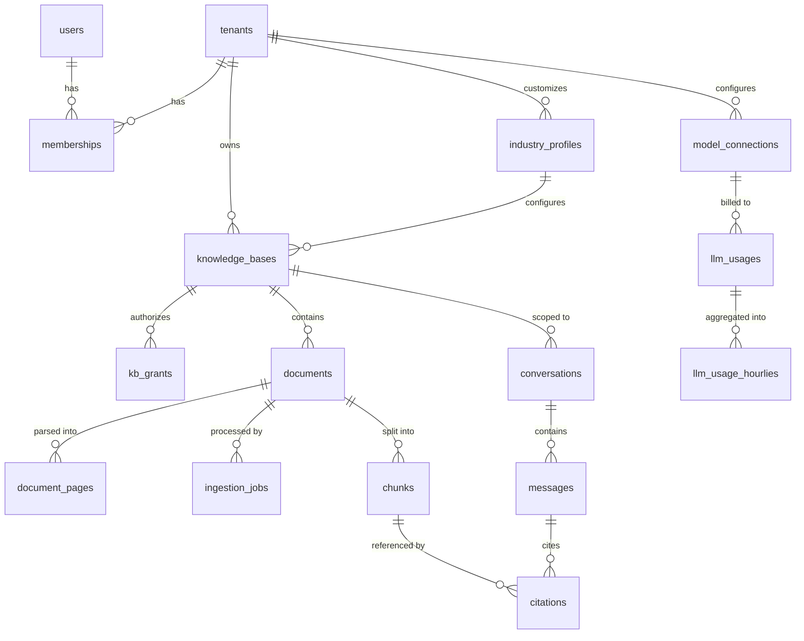

# 02 数据模型

## 1. 建模原则

1. **所有业务表携带 `tenant_id`**，无一例外，包括看似全局的配置表（内置模板用 `tenant_id = NULL` 表示系统级）。
2. **主键统一使用 UUID v7**，时间有序，既避免自增 ID 泄露业务量，又保留 B-tree 插入的局部性。
3. **软删除只用于用户可见的资源**（知识库、文档、会话），`chunks` 等派生数据物理删除，避免向量索引膨胀。
4. **派生数据可重建**：`chunks` 全部可从 `documents` + `document_pages` 重新生成，因此它不是备份的必需项。
5. **时间戳统一 `timestamptz`，全库 UTC 存储**，展示时区在前端处理。

## 2. 实体关系



## 3. 多租户隔离

### 3.1 策略：共享库 + 行级安全（RLS）+ 应用层显式过滤

单靠应用层过滤，一次 `WHERE tenant_id` 的遗漏就是一次跨租户数据泄露；单靠 RLS，一次连接池会话变量的错乱同样致命。两者叠加，任一层失效都不会造成泄露。

```sql
ALTER TABLE documents ENABLE ROW LEVEL SECURITY;
ALTER TABLE documents FORCE ROW LEVEL SECURITY;

CREATE POLICY tenant_isolation ON documents
    USING (tenant_id = current_setting('app.current_tenant_id', true)::uuid);
```

应用层通过 FastAPI 依赖注入，在每个请求获取连接后立即设置会话变量：

```python
async def scoped_session(tenant: Tenant = Depends(current_tenant)):
    async with SessionLocal() as session:
        await session.execute(
            text("SELECT set_config('app.current_tenant_id', :tid, true)"),
            {"tid": str(tenant.id)},
        )
        yield session
```

`set_config(..., true)` 的第三个参数表示事务级生效，事务结束自动重置，避免连接归还池后污染下一个请求。这一点是本方案能与连接池共存的关键。

Celery Worker 中没有 HTTP 请求上下文，任务参数必须显式携带 `tenant_id`，并在任务入口做同样的设置。

### 3.2 迁移出口

当某个大客户提出物理隔离要求时，`tenant_id` 已经是所有表的前缀列，按租户导出并切库的成本可控。届时通过路由层根据租户选择数据源，业务代码不变。

## 4. 表结构

### 4.1 身份与租户

```sql
CREATE TABLE tenants (
    id           uuid PRIMARY KEY,
    slug         text NOT NULL UNIQUE,           -- 用于子域名/URL
    name         text NOT NULL,
    status       text NOT NULL DEFAULT 'active', -- active | suspended
    quota        jsonb NOT NULL DEFAULT '{}',    -- 文档数、存储、月度 token 上限
    created_at   timestamptz NOT NULL DEFAULT now(),
    updated_at   timestamptz NOT NULL DEFAULT now()
);

CREATE TABLE users (
    id            uuid PRIMARY KEY,
    email         citext NOT NULL UNIQUE,
    password_hash text,                          -- 为空表示仅支持 SSO 登录
    display_name  text NOT NULL,
    status        text NOT NULL DEFAULT 'active',
    last_login_at timestamptz,
    created_at    timestamptz NOT NULL DEFAULT now()
);

-- 用户与租户的多对多，角色在租户维度
CREATE TABLE memberships (
    id         uuid PRIMARY KEY,
    tenant_id  uuid NOT NULL REFERENCES tenants(id) ON DELETE CASCADE,
    user_id    uuid NOT NULL REFERENCES users(id) ON DELETE CASCADE,
    role       text NOT NULL,                    -- owner | admin | member
    created_at timestamptz NOT NULL DEFAULT now(),
    UNIQUE (tenant_id, user_id)
);
```

`users` 是全局表（一个人可属于多个租户），不加 RLS；`memberships` 加 RLS。

### 4.2 行业配置

行业差异全部收敛到这张表，它是"多行业通用"这一产品定位的技术落点。

```sql
CREATE TABLE industry_profiles (
    id          uuid PRIMARY KEY,
    tenant_id   uuid REFERENCES tenants(id) ON DELETE CASCADE, -- NULL = 系统内置模板
    code        text NOT NULL,                  -- discrete_manufacturing | process_industry | general
    name        text NOT NULL,
    parse_rules   jsonb NOT NULL DEFAULT '{}',  -- OCR 开关、表格策略、页眉页脚剔除规则
    chunk_rules   jsonb NOT NULL DEFAULT '{}',  -- 分块尺寸、重叠、标题层级感知、表格保全
    metadata_schema jsonb NOT NULL DEFAULT '{}',-- 该行业文档的自定义元数据字段定义
    prompt_overrides jsonb NOT NULL DEFAULT '{}',-- 系统提示词、术语表、拒答话术
    retrieval_rules jsonb NOT NULL DEFAULT '{}',-- top_k、启用的召回路径、是否重排、拒答阈值
    is_builtin  boolean NOT NULL DEFAULT false,
    created_at  timestamptz NOT NULL DEFAULT now(),
    updated_at  timestamptz NOT NULL DEFAULT now(),
    UNIQUE (tenant_id, code)
);
```

配置解析顺序为：知识库级覆盖 → 租户自定义 profile → 系统内置 profile → 代码内默认值。四级回退在 `profile.service.resolve(kb_id)` 中实现，返回一个强类型的 `EffectiveProfile` 对象，调用方不感知回退逻辑。

**jsonb 而非独立列的理由**：行业配置项会持续增加，每次加字段都做一次 DDL 迁移不现实。代价是失去数据库层校验，因此在应用层用 Pydantic 模型对 jsonb 做严格校验，写入前必须通过。

### 4.3 知识库与授权

```sql
CREATE TABLE knowledge_bases (
    id           uuid PRIMARY KEY,
    tenant_id    uuid NOT NULL REFERENCES tenants(id) ON DELETE CASCADE,
    profile_id   uuid REFERENCES industry_profiles(id),
    name         text NOT NULL,
    description  text,
    embedding_model text NOT NULL,      -- 记录建库时的模型，切换需重建
    embedding_dim   integer NOT NULL,
    visibility   text NOT NULL DEFAULT 'private',  -- private | tenant
    settings     jsonb NOT NULL DEFAULT '{}',      -- 覆盖 profile 的局部配置
    doc_count    integer NOT NULL DEFAULT 0,
    chunk_count  integer NOT NULL DEFAULT 0,
    deleted_at   timestamptz,
    created_by   uuid NOT NULL REFERENCES users(id),
    created_at   timestamptz NOT NULL DEFAULT now()
);

-- 知识库级授权；visibility = 'tenant' 时全租户可读，此表仅记录额外的写权限
CREATE TABLE kb_grants (
    id         uuid PRIMARY KEY,
    tenant_id  uuid NOT NULL,
    kb_id      uuid NOT NULL REFERENCES knowledge_bases(id) ON DELETE CASCADE,
    user_id    uuid NOT NULL REFERENCES users(id) ON DELETE CASCADE,
    permission text NOT NULL,           -- read | write | manage
    created_at timestamptz NOT NULL DEFAULT now(),
    UNIQUE (kb_id, user_id)
);
```

权限判定的唯一入口是 `identity.service.visible_kb_ids(user, permission)`，返回用户在当前租户下具备指定权限的知识库 ID 集合。检索层拿到的是这个集合，而不是用户对象——检索层不应该理解权限模型。

### 4.4 文档与解析产物

```sql
CREATE TABLE documents (
    id            uuid PRIMARY KEY,
    tenant_id     uuid NOT NULL,
    kb_id         uuid NOT NULL REFERENCES knowledge_bases(id) ON DELETE CASCADE,
    title         text NOT NULL,
    source_type   text NOT NULL,        -- upload | url | sync
    mime_type     text NOT NULL,
    file_size     bigint NOT NULL,
    checksum      text NOT NULL,        -- SHA256，用于同库查重
    storage_key   text NOT NULL,        -- 对象存储 key
    page_count    integer,
    status        text NOT NULL DEFAULT 'pending',
                  -- pending|parsing|chunking|embedding|ready|failed
    error_code    text,
    error_detail  text,
    metadata      jsonb NOT NULL DEFAULT '{}',  -- 按 profile.metadata_schema 校验
    deleted_at    timestamptz,
    uploaded_by   uuid NOT NULL REFERENCES users(id),
    created_at    timestamptz NOT NULL DEFAULT now(),
    updated_at    timestamptz NOT NULL DEFAULT now()
);

CREATE UNIQUE INDEX uq_doc_checksum ON documents (kb_id, checksum) WHERE deleted_at IS NULL;
CREATE INDEX idx_doc_kb_status ON documents (kb_id, status) WHERE deleted_at IS NULL;

-- 解析中间产物，保留它使得重新分块无需重新解析（OCR 很贵）
CREATE TABLE document_pages (
    id          uuid PRIMARY KEY,
    tenant_id   uuid NOT NULL,
    document_id uuid NOT NULL REFERENCES documents(id) ON DELETE CASCADE,
    page_no     integer NOT NULL,
    width       real NOT NULL,          -- 页面尺寸，用于前端坐标换算
    height      real NOT NULL,
    blocks      jsonb NOT NULL,         -- 版面块数组：类型/文本/bbox/层级
    plain_text  text NOT NULL,
    UNIQUE (document_id, page_no)
);
```

`blocks` 中每个元素的结构：

```json
{
  "type": "heading|paragraph|table|list|figure_caption",
  "level": 2,
  "text": "3.2 液压系统日常点检",
  "bbox": [72.0, 310.5, 523.0, 328.0],
  "order": 14
}
```

坐标系约定为 PDF 用户空间（左上角原点，单位 pt），与 `document_pages.width/height` 同一坐标系，前端按渲染缩放比例换算即可，无需后端参与。

### 4.5 分块与向量

```sql
CREATE EXTENSION IF NOT EXISTS vector;

CREATE TABLE chunks (
    id            uuid PRIMARY KEY,
    tenant_id     uuid NOT NULL,
    kb_id         uuid NOT NULL,
    document_id   uuid NOT NULL REFERENCES documents(id) ON DELETE CASCADE,
    seq           integer NOT NULL,        -- 文档内顺序，用于上下文扩展
    content       text NOT NULL,           -- 送入 Embedding 的最终文本
    raw_content   text NOT NULL,           -- 展示给用户的原始文本（不含标题路径前缀）
    heading_path  text[] NOT NULL DEFAULT '{}',  -- ['3 维护保养','3.2 液压系统日常点检']
    chunk_type    text NOT NULL DEFAULT 'text',  -- text | table | list
    page_start    integer NOT NULL,
    page_end      integer NOT NULL,
    bboxes        jsonb NOT NULL DEFAULT '[]',   -- [{page:12,bbox:[...]}, ...] 支持跨页高亮
    token_count   integer NOT NULL,
    embedding     vector(1024) NOT NULL,
    tsv           tsvector NOT NULL,
    metadata      jsonb NOT NULL DEFAULT '{}',
    created_at    timestamptz NOT NULL DEFAULT now(),
    UNIQUE (document_id, seq)
);
```

#### 索引策略

```sql
-- 向量索引：HNSW，余弦距离
CREATE INDEX idx_chunks_embedding ON chunks
    USING hnsw (embedding vector_cosine_ops)
    WITH (m = 16, ef_construction = 64);

-- 全文索引
CREATE INDEX idx_chunks_tsv ON chunks USING gin (tsv);

-- 过滤前置：检索永远带 kb_id 约束
CREATE INDEX idx_chunks_kb ON chunks (kb_id);
CREATE INDEX idx_chunks_doc ON chunks (document_id, seq);
```

关于 HNSW 与过滤的配合：pgvector 的 HNSW 在带 `WHERE kb_id IN (...)` 时执行的是后过滤，若知识库很多而单库占比很小，会出现召回不足。应对方式是查询时提高 `hnsw.ef_search`（默认 40，检索时设为 `max(100, top_k * 8)`），并在召回数量不足预期时自动降级为该 kb 的精确扫描。在 10 万页量级下，即使全表精确扫描也在百毫秒内，这个降级是安全的。

参数选择说明：`m=16, ef_construction=64` 是 pgvector 的推荐起点，在 20 万级向量上召回率约 0.98、构建时间可接受。若后续召回率不达标，优先调 `ef_search`（查询期参数，无需重建索引），其次才考虑提高 `m` 重建。

#### 中文全文检索

不依赖 `zhparser`，改为应用层分词后写入：

```python
def build_tsv(text: str) -> str:
    tokens = jieba.lcut_for_search(text)
    return " ".join(t for t in tokens if t.strip())

# 写入时
stmt = insert(Chunk).values(
    ...,
    tsv=func.to_tsvector("simple", build_tsv(chunk.content)),
)
```

查询侧用同样的分词函数处理 query，保证训练/推理一致。使用 `simple` 配置（不做词干还原）是刻意的：工业术语如"轴承座""液压缸"经过英文词干规则处理只会变差。行业术语表通过 `jieba.load_userdict` 从 `industry_profiles.parse_rules.dictionary` 动态加载。

### 4.6 摄取任务

```sql
CREATE TABLE ingestion_jobs (
    id           uuid PRIMARY KEY,
    tenant_id    uuid NOT NULL,
    document_id  uuid NOT NULL REFERENCES documents(id) ON DELETE CASCADE,
    stage        text NOT NULL,          -- parse | chunk | embed
    status       text NOT NULL,          -- queued | running | succeeded | failed
    attempt      integer NOT NULL DEFAULT 0,
    progress     real NOT NULL DEFAULT 0,
    celery_task_id text,
    error_code   text,
    error_detail text,
    started_at   timestamptz,
    finished_at  timestamptz,
    created_at   timestamptz NOT NULL DEFAULT now()
);

CREATE INDEX idx_jobs_doc ON ingestion_jobs (document_id, created_at DESC);
```

任务表与 Celery 的关系：Celery 负责调度与重试，`ingestion_jobs` 负责**面向用户的可见状态与可审计的历史**。两者职责不重叠，不要试图用 Celery 的 result backend 承担用户可见状态，它的过期策略和查询能力都不适合。

### 4.7 会话与引用

```sql
CREATE TABLE conversations (
    id         uuid PRIMARY KEY,
    tenant_id  uuid NOT NULL,
    user_id    uuid NOT NULL REFERENCES users(id),
    kb_ids     uuid[] NOT NULL,          -- 本次会话检索范围
    title      text NOT NULL DEFAULT '新会话',
    deleted_at timestamptz,
    created_at timestamptz NOT NULL DEFAULT now(),
    updated_at timestamptz NOT NULL DEFAULT now()
);

CREATE TABLE messages (
    id              uuid PRIMARY KEY,
    tenant_id       uuid NOT NULL,
    conversation_id uuid NOT NULL REFERENCES conversations(id) ON DELETE CASCADE,
    role            text NOT NULL,       -- user | assistant | system
    content         text NOT NULL,
    status          text NOT NULL DEFAULT 'completed', -- streaming | completed | failed
    retrieval_meta  jsonb,               -- 改写后的 query、召回数、各阶段耗时
    token_usage     jsonb,
    model           text,
    created_at      timestamptz NOT NULL DEFAULT now()
);

CREATE INDEX idx_msg_conv ON messages (conversation_id, created_at);

-- 引用快照：即使源 chunk 后续被删除或重建，历史回答的引用依然可读
CREATE TABLE citations (
    id           uuid PRIMARY KEY,
    tenant_id    uuid NOT NULL,
    message_id   uuid NOT NULL REFERENCES messages(id) ON DELETE CASCADE,
    chunk_id     uuid,                   -- 不设外键，允许 chunk 被删除
    document_id  uuid NOT NULL,
    index_no     integer NOT NULL,       -- 正文中的 [1][2] 编号
    quote        text NOT NULL,          -- 快照文本
    page_start   integer NOT NULL,
    bboxes       jsonb NOT NULL,
    score        real NOT NULL,
    UNIQUE (message_id, index_no)
);
```

`citations` 冗余存储 `quote` 和 `bboxes` 是有意的反规范化。文档会被重新解析、重新分块，chunk_id 会变。如果引用只存 chunk_id，用户三个月后回看历史会话会发现引用全部失效——这在工业场景（回答可能被写进检修记录）是不可接受的。

### 4.8 模型接入与用量

设计说明见 01 文档 4.3 节。这里是它的存储落点，共四张表：接入点、单价、用量明细、用量预聚合。

```sql
-- 接入点：一个厂商端点 + 一组凭证 + 一个模型标识
CREATE TABLE model_connections (
    id             uuid PRIMARY KEY,
    tenant_id      uuid REFERENCES tenants(id) ON DELETE CASCADE, -- NULL = 平台级，全租户共用
    name           text NOT NULL,
    provider_type  text NOT NULL,        -- openai_compatible | fake
    base_url       text NOT NULL,
    credential_ref text NOT NULL,        -- 指向密钥管理服务，绝不存明文
    model          text NOT NULL,        -- 厂商侧模型标识
    purposes       text[] NOT NULL,      -- {chat,embedding,rerank,title}
    priority       integer NOT NULL DEFAULT 100,  -- 同用途下越小越优先
    enabled        boolean NOT NULL DEFAULT true,
    health         text NOT NULL DEFAULT 'unknown', -- healthy|degraded|down|unknown
    health_checked_at timestamptz,
    extra          jsonb NOT NULL DEFAULT '{}',   -- 超时、重试、并发上限等
    version        integer NOT NULL DEFAULT 1,    -- 变更递增，用于失效 Provider 实例缓存
    created_at     timestamptz NOT NULL DEFAULT now(),
    updated_at     timestamptz NOT NULL DEFAULT now()
);

-- 路由查询命中此索引：按用途 + 优先级取第一个健康接入点
CREATE INDEX idx_conn_route ON model_connections (tenant_id, enabled, priority)
    WHERE enabled;

-- 单价表：带生效区间，支持厂商调价
CREATE TABLE model_pricing (
    id                  uuid PRIMARY KEY,
    provider_type       text NOT NULL,
    model               text NOT NULL,
    prompt_price_per_1k     numeric(12, 6) NOT NULL,
    completion_price_per_1k numeric(12, 6) NOT NULL,
    currency            text NOT NULL DEFAULT 'USD',
    effective_from      timestamptz NOT NULL,
    effective_to        timestamptz,      -- NULL 表示当前生效
    UNIQUE (provider_type, model, effective_from)
);

-- 用量明细
CREATE TABLE llm_usages (
    id            uuid PRIMARY KEY,
    tenant_id     uuid NOT NULL,
    user_id       uuid,
    connection_id uuid,                  -- 不设外键，接入点删除后历史用量仍需可查
    kb_id         uuid,                  -- 用于"按知识库归因"排行
    purpose       text NOT NULL,         -- chat | embedding | rerank | title
    provider_type text NOT NULL,
    model         text NOT NULL,
    prompt_tokens integer NOT NULL DEFAULT 0,
    completion_tokens integer NOT NULL DEFAULT 0,
    cost          numeric(12, 6) NOT NULL DEFAULT 0,  -- 写入时按当时单价快照
    currency      text NOT NULL DEFAULT 'USD',
    latency_ms    integer NOT NULL,
    success       boolean NOT NULL,
    error_code    text,
    created_at    timestamptz NOT NULL DEFAULT now()
) PARTITION BY RANGE (created_at);

CREATE INDEX idx_usage_tenant_time ON llm_usages (tenant_id, created_at DESC);

-- 预聚合：仪表盘只读这张表
CREATE TABLE llm_usage_hourlies (
    tenant_id     uuid NOT NULL,
    bucket_hour   timestamptz NOT NULL,  -- UTC 整点，前端按租户时区重组为天
    model         text NOT NULL,
    purpose       text NOT NULL,
    connection_id uuid,
    call_count    integer NOT NULL DEFAULT 0,
    success_count integer NOT NULL DEFAULT 0,
    prompt_tokens bigint NOT NULL DEFAULT 0,
    completion_tokens bigint NOT NULL DEFAULT 0,
    cost          numeric(14, 6) NOT NULL DEFAULT 0,
    latency_p95_ms integer,
    PRIMARY KEY (tenant_id, bucket_hour, model, purpose, connection_id)
);

CREATE INDEX idx_hourly_range ON llm_usage_hourlies (tenant_id, bucket_hour DESC);
```

几点说明：

- `llm_usages` 是成本归因与配额限制的唯一事实来源，按月分区，保留 13 个月；写入走 Redis 缓冲 + 批量 flush，不阻塞主链路。
- `cost` 在写入时按 `model_pricing` 当时生效的单价算好并快照。查询时不再重算——厂商调价不应该让上个季度的成本报表发生变化。
- `llm_usage_hourlies` 由统计 Worker 每小时增量刷新，用 `INSERT ... ON CONFLICT DO UPDATE` 幂等写入，允许重跑补数。**主键选用小时桶而非天桶**是为了时区正确性，理由见 01 文档 4.3.3。
- `latency_p95_ms` 在小时桶内用 `percentile_disc` 计算。跨桶展示时取各桶的最大值作为近似，这是有偏的，但对"哪个接入点在拖慢体验"这个判断足够；需要精确分位数时回查明细表。

### 4.9 审计日志

```sql
CREATE TABLE audit_logs (
    id          uuid PRIMARY KEY,
    tenant_id   uuid NOT NULL,
    actor_id    uuid,
    action      text NOT NULL,          -- kb.delete | document.export | grant.update ...
    target_type text NOT NULL,
    target_id   uuid,
    payload     jsonb NOT NULL DEFAULT '{}',
    ip          inet,
    created_at  timestamptz NOT NULL DEFAULT now()
);
```

## 5. 数据生命周期

| 数据 | 保留策略 |
| --- | --- |
| 原始文件（对象存储） | 随文档软删除保留 30 天，之后由清理任务物理删除 |
| `document_pages` | 与文档同生命周期；重建索引时复用 |
| `chunks` | 文档删除即物理删除；重新分块时先删后建，同事务内完成 |
| `messages` / `citations` | 长期保留，租户可主动清理 |
| `llm_usages` | 分区表，保留 13 个月，按月 detach 归档 |
| `llm_usage_hourlies` | 永久保留（体量小）；超过 13 个月的部分因明细已归档而不可重算，需一并备份 |
| `audit_logs` | 保留 3 年 |

## 6. 索引重建流程

切换 Embedding 模型或调整分块策略时，不能停服。流程为：

1. 在 `knowledge_bases` 上新增字段 `pending_index_version`，后台任务按新配置写入 `chunks_v2`（同结构表或同表加 `index_version` 列）。
2. 重建期间检索仍走旧版本。
3. 全量完成并通过抽样评测后，在单个事务内切换 `active_index_version`。
4. 旧版本数据延迟 24 小时删除，保留回滚窗口。

首期实现可以简化为"重建期间该知识库只读"，但表结构中的 `index_version` 列要提前预留，避免后续做一次痛苦的迁移。

---

上一篇：[01 架构设计](./01-architecture.md) ｜ 下一篇：[03 API 设计](./03-api.md)
