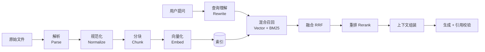

# 04 RAG 流水线

这是整个平台的技术核心。RAG 系统的质量瓶颈几乎从不在生成模型，而在**解析是否忠实、分块是否完整、召回是否命中**。本文档按数据流顺序展开。

## 1. 总览



每个阶段的参数都来自 `EffectiveProfile`（见 02 文档 4.2），行业差异在此生效，代码路径完全一致。

## 2. 解析

### 2.1 解析器矩阵

| 格式 | 主解析器 | 处理要点 |
| --- | --- | --- |
| PDF（文本层） | PyMuPDF | 提取字符级 bbox、字号、字体，用于标题识别与坐标回溯 |
| PDF（扫描件） | PyMuPDF 判定 + PaddleOCR | 每页文本字符数 < 阈值判为图片页，逐页 OCR，OCR 结果同样带 bbox |
| DOCX | python-docx | 按样式名映射标题层级；表格转 Markdown |
| XLSX | openpyxl | 每个 sheet 独立处理，首行为表头，合并单元格向下填充 |
| PPTX | python-pptx | 每页为一个逻辑单元，含备注 |
| Markdown / TXT | 内置 | 直接使用，Markdown 天然带层级 |
| HTML | trafilatura | 去除导航与广告，保留正文结构 |

选择 PyMuPDF 而非 pdfplumber：前者速度约快一个数量级，且能拿到字符级坐标；后者的表格提取更强，因此**表格区域用 pdfplumber 二次处理**，其余走 PyMuPDF。这是刻意的混用，不是选型摇摆。

### 2.2 是否 OCR 的判定

OCR 昂贵且慢，必须精确判定，不能全量开。逐页判定规则：

```python
def needs_ocr(page) -> bool:
    text = page.get_text().strip()
    if len(text) >= profile.ocr_text_threshold:      # 默认 50 字符
        return False
    image_area_ratio = compute_image_coverage(page)   # 图片覆盖面积占比
    return image_area_ratio > 0.5
```

即"文本极少 且 页面主要由图片构成"才 OCR。只有少量文字的纯封面页、分隔页会被正确跳过。判定结果记入 `document_pages.blocks` 的元信息，便于事后审计某页为什么没被 OCR。

实测补充（6 份 AQ 标准，200 dpi，PP-OCRv4）：

| 观察 | 数据 | 对设计的影响 |
| --- | --- | --- |
| 坐标质量 | 168 个文本框零非法零越界，可视化确认框线严丝合缝 | ADR-005 对 OCR 页同样成立，引用高亮无需为扫描件另做一套 |
| 字符编码 | OCR 输出是干净 ASCII，零错误映射 | 字体错误映射只发生在有文本层的 PDF；**扫描件反而更干净** |
| 置信度 | 均值 0.81，35.7% 的文本框低于 0.8 | 低置信度需处理，见下 |
| 单页耗时 | 中位 6.3 s，最大 10.6 s | 100 页约 10 分钟，超出性能目标，见下 |

**低置信度文本的处理**：不能直接丢弃，那会造成静默的信息缺失；也不能无差别入库，那会污染检索。做法是照常入库但在 `chunks.metadata` 中记录 `ocr_confidence`，检索时不过滤，而是在引用卡片上标注"该段来自 OCR 识别，建议核对原文"。把判断权交给用户，比系统替用户做一个大概率错误的决定要好。

低置信度高度集中在两类区域：**页面水印覆盖处**和标题行。水印是扫描版标准文件的常态，这意味着 OCR 置信度的绝对值在这类文档上会系统性偏低，阈值不能照搬通用场景的经验值，需要按行业标定。

**OCR 必须页级并行**。单页 6.3 秒是无法通过换引擎显著改善的（这是 PP-OCRv4 在 CPU 上的正常水平），唯一的解法是把一个文档的 N 页拆成 N 个可并行的子任务，而不是一个 Worker 从头串到尾。这改变了 `ingestion` 的任务粒度：解析阶段的调度单位应当是**页**而非文档，文档级状态由页级任务的聚合结果推导。

### 2.3 版面规范化

解析产出统一的中间表示后，做四件清理工作。**顺序不能调换**，字符规范化必须最先执行，否则后续所有基于文本匹配的步骤都建立在错误的字符上。

**字符规范化**：这一步是跑真实国标文档后补上的，原设计遗漏了它。

大量 GB / AQ 系列标准 PDF 使用了带错误 ToUnicode CMap 的字体，**拉丁字母会被映射到 CJK 汉字区**：`AQ/T 4127—2018` 提取出来是 `犃犙／犜４１２７—２０１８`，中文正常但字母全废。同时数字与标点普遍是全角。实测 6 份 AQ 标准，有文本层的 3 份全部中招，单份文档 117 处错误映射、25% 的字符是全角。

修复分两步，都是确定性的查表操作，不需要模型：

```python
_UPPER = "犃犅犆犇犈犉犌犎犐犑犓犔犕犖犗犘犙犚犛犜犝犞犠犡犢犣"
_LOWER = "犪犫犮犱犲犳犵犺犻犼犽犾犿狀狅狆狇狉狊狋狌狏狑狓狔狕"
CJK_LATIN_MAP = {ord(c): chr(ord("A") + i) for i, c in enumerate(_UPPER)}
CJK_LATIN_MAP |= {ord(c): chr(ord("a") + i) for i, c in enumerate(_LOWER)}

def normalize(text: str) -> str:
    return unicodedata.normalize("NFKC", text.translate(CJK_LATIN_MAP))
```

不做这一步的后果是 5.2 节的混合检索直接塌一半：BM25 在这套设计里的全部意义就是精确命中型号、标准号、错误码，而这些字符串入库时根本不是 ASCII，用户搜 `AQ 4127` 永远搜不到。这属于**静默失效**——检索照常返回结果，只是永远不包含正确答案，上线后极难归因。

规范化只作用于 `chunk.content`（用于向量化与 BM25）；`raw_content` 保留原始字符，展示时与原文一致。

**页眉页脚剔除**：按 y 坐标把 span 聚成行，取每页首尾各 2 行做频次统计，归一化掉数字与罗马数字页码后，出现频次超过页数 60% 的行判为页眉页脚。

这里原本用的是"顶部/底部 8% 区域"的固定带宽，实测证明该方法不成立：AQ 标准的页眉底边在页高 10.4% 处，而正文首行顶边在 11.0% 处，8% 够不着页眉，放宽到 12% 又会吃进正文，可用窗口只有 0.6% —— 任何硬编码比例都是在赌排版。改成行聚类后不依赖比例常数，对不同排版自适应。

需保留页码信息用于溯源，但不进入 chunk 文本。

**标题层级识别**：优先用 PDF 大纲（outline/TOC）；无大纲时按"字号 + 加粗 + 编号模式"综合打分。工业文档的章节编号非常规整，编号模式的权重应高于字号。

编号正则不能要求编号后有分隔符。国标类文档普遍写作「1范围」「4.1企业应制定…」，编号与文字之间没有空格，用 `^\d+(\.\d+)*\s` 在真实 AQ 标准上一条都匹配不到。正确的写法是允许编号后直接跟中文：

```python
NUMBERING = re.compile(r"^\d+(\.\d+)*(?:[\s、.．]|(?=[\u4e00-\u9fff])|$)")
```

放宽后同一份文档的识别数从 0 条变为 21 条。注意 `\d` 在 Python 中默认匹配 Unicode 数字，全角 `４` 也能命中，但字符规范化已经在上一步把它们转成半角了。

**表格处理**：表格转为 Markdown 表格文本，并在前面附加一行自然语言描述（表格上方最近的段落或图表标题）。原因是纯表格的向量化效果差，一句描述能显著提升召回。表格块标记 `chunk_type='table'`，在后续分块中**不允许被切分**。

**输出**：`document_pages.blocks`，每块含 type、level、text、bbox、order。

## 3. 分块

分块是对最终效果影响最大、也最容易做错的一步。

### 3.1 策略：结构感知 + 长度约束

不使用固定长度滑窗切分，那会把一句话从中间劈开，导致语义破碎。算法为：

```
1. 按标题层级把文档切成语义段（section）
2. 对每个 section：
   a. 若 token 数 ≤ max_tokens，整体作为一个 chunk
   b. 否则按段落边界贪心累加，超过 max_tokens 时断开
   c. 单个段落本身超长时，按句子边界（。！？；\n）切分
3. 表格块独立成 chunk，永不切分；超长表格按行切分并在每片重复表头
4. 每个 chunk 前置 heading_path 作为上下文前缀
5. 相邻 chunk 保留 overlap_tokens 的重叠
```

### 3.2 条款式文档的切分

标准、规程、制度类文档的结构单位不是"标题行"，而是**行首的条款号**：`4.1 企业应制定设备检修相关管理制度，根据……` 编号与正文在同一行，整章之下没有任何独立标题行。若只按标题层级切分，一整章会并成一个巨大的 chunk。

因此 section 的切分点有两类，任一命中即断开：

1. 独立标题行（走 2.3 的标题识别）；
2. 行首匹配多级条款号 `^\d+(\.\d+)+` 且其后直接跟正文的行。

条款式切分下，`heading_path` 由条款号自身的层级推导（`4.1.2` → `4 > 4.1 > 4.1.2`），不依赖标题文本。这类文档的条款通常短小且彼此独立，正是 3.3 节里流程工业模板把 `max_tokens` 降到 384、`overlap` 降到 32 的原因——条款之间强行重叠只会把不相干的规定混在一起。

是否启用由 `chunk_rules.clause_mode` 控制，默认关闭，流程工业模板开启。

### 3.3 标题路径前缀

这是低成本高收益的一步。存储时区分两个字段：

```python
chunk.raw_content = "当系统压力超过 16 MPa 时，溢流阀应自动开启泄压……"
chunk.content = (
    "《液压站操作手册》> 4 故障处理 > 4.3 压力异常\n\n"
    "当系统压力超过 16 MPa 时，溢流阀应自动开启泄压……"
)
```

`content` 用于向量化和 BM25，`raw_content` 用于展示。工业文档中大量段落脱离章节标题后是无法理解的（"应每 500 小时更换一次"——换什么？），加上标题路径后，语义完整性大幅提升，而展示时又不会有冗余。

### 3.4 参数与行业差异

| 参数 | 默认 | 说明 |
| --- | --- | --- |
| `max_tokens` | 512 | 上限；过大稀释语义，过小丢失上下文 |
| `min_tokens` | 80 | 低于此值与相邻块合并，避免碎片 |
| `overlap_tokens` | 64 | 段落边界切分时的重叠 |
| `respect_heading_levels` | 3 | 到几级标题为止建立 section |
| `table_as_atomic` | true | 表格不切分 |
| `keep_heading_prefix` | true | 是否加标题路径前缀 |
| `clause_mode` | false | 按行首条款号切分，见 3.2；标准/规程类文档需开启 |

不同行业的典型覆盖：

- **流程工业**（工艺规程、HAZOP、国标类）：条款密集且相互独立，`clause_mode` 开启，`max_tokens` 降到 384，`overlap` 降到 32，避免把不相干的条款塞进同一块。
- **离散制造**（设备手册、SOP）：步骤有强顺序依赖，`overlap_tokens` 提到 128，防止操作步骤被割裂。
- **通用企业文档**：用默认值。

这些差异全部是 `industry_profiles.chunk_rules` 中的数值，不产生代码分支。

## 4. 向量化

- **批量**：每批 64 条，并发 4，控制在 Provider 的速率限制内。
- **区分 input_type**：`bge-m3` 等模型对 query 和 document 使用不同前缀，混用会掉点。Provider 接口强制传 `input_type` 参数，不给默认值，逼迫调用方显式决策。
- **缓存**：以 `sha256(model + input_type + text)` 为键缓存向量结果。重新分块时大量 chunk 文本未变，缓存命中率通常在 60% 以上，直接省下等比例的 API 成本。
- **失败处理**：单批失败重试 3 次（指数退避）；仍失败则整个文档标记 `failed`，已写入的 chunks 在同事务内回滚，不允许出现"半个文档"进入索引——半个文档比没有文档更危险，用户会以为资料已经完整可查。

## 5. 检索

### 5.1 查询理解

| 步骤 | 处理 | 何时启用 |
| --- | --- | --- |
| 多轮指代消解 | 用历史消息把"它""这个设备"补全为具体实体 | 会话轮次 > 1 |
| 术语归一 | 按行业术语表映射同义词（"泵浦"→"泵"） | 术语表非空时 |
| 查询扩展 | LLM 生成 2 条改写 query，多路召回后合并 | 首轮召回分数普遍偏低时（自适应触发） |

指代消解用一次小模型调用完成，成本低但对多轮体验的提升非常明显。查询扩展默认关闭，因为它会让延迟翻倍，只在自适应条件下触发。

### 5.2 混合召回

两路召回分别是 01 文档 4.2 中 `Retriever` 接口的 `VectorRetriever` 与 `FulltextRetriever` 实现，由融合层并行发起：

```sql
-- 向量召回
SET LOCAL hnsw.ef_search = 100;
SELECT id, 1 - (embedding <=> :qvec) AS score
FROM chunks
WHERE kb_id = ANY(:kb_ids)
ORDER BY embedding <=> :qvec
LIMIT :k;

-- 全文召回
SELECT id, ts_rank_cd(tsv, query) AS score
FROM chunks, to_tsquery('simple', :tokens) query
WHERE kb_id = ANY(:kb_ids) AND tsv @@ query
ORDER BY score DESC
LIMIT :k;
```

**为什么必须有 BM25**：工业场景充斥着型号（`HYD-2201`）、标准号（`GB/T 3766`）、错误码（`E-0512`）。这类字符串在向量空间中几乎没有区分度，纯向量检索会把 `HYD-2201` 和 `HYD-2210` 视为近似。全文检索的精确匹配能力在这里是不可替代的。反过来，"压力上不去是什么原因"这类口语化提问，BM25 又无能为力。两者互补，缺一不可。

这一路的有效性完全依赖 2.3 节的字符规范化。查询侧也必须走同一个 `normalize()` 函数——用户可能从 PDF 里复制一段带全角数字的标准号来搜，两侧不一致就必然搜不到。**规范化函数只能有一份实现，索引侧和查询侧共用**，这是这类问题唯一可靠的防线。

### 5.3 RRF 融合

用 Reciprocal Rank Fusion 而非加权分数相加：

```python
def rrf(rank_lists: list[list[str]], k: int = 60) -> dict[str, float]:
    scores = defaultdict(float)
    for ranks in rank_lists:
        for pos, chunk_id in enumerate(ranks):
            scores[chunk_id] += 1.0 / (k + pos + 1)
    return scores
```

余弦相似度与 `ts_rank_cd` 的量纲完全不同，且分布随查询漂移，做归一化后加权本质上是在调一个没有稳定最优解的参数。RRF 只用排名，无需归一化，鲁棒性显著更好，`k=60` 是被广泛验证的默认值。

### 5.4 重排

RRF 后取 Top-30 送入 Cross-Encoder 重排，输出 Top-5～8。重排是提升精度最有效的单一手段（典型 nDCG 提升 10–20 个百分点），代价是增加 100–300 ms 延迟。

MVP 默认关闭，通过 `retrieval_rules.rerank_enabled` 开启。上线后一旦评测显示精度不足，这是第一张要打的牌。

### 5.5 上下文扩展

命中 chunk 后，按 `expand_context` 参数把相邻 chunk（同文档 `seq ± n`）一并取回并按顺序拼接。工业文档的操作步骤常跨越分块边界，命中"步骤 3"却不给"步骤 4"，回答就是错的。默认 `n=1`，表格类 chunk 不扩展。

### 5.6 权限过滤

检索的第一步永远是把 `kb_ids` 收窄到 `identity.service.visible_kb_ids(user, "read")` 的交集。**过滤在 SQL 中前置完成，不在应用层对结果集做后过滤**——后过滤会导致 top_k 不足，且是典型的权限泄漏路径。

## 6. 生成

### 6.1 提示词结构

```
[系统提示 · 来自 profile.prompt_overrides.system]
你是{industry_name}领域的技术助手。严格依据下方提供的资料回答问题。

规则：
1. 只使用资料中的信息，不得补充资料之外的知识。
2. 每个事实性陈述后必须标注来源编号，格式为 [1]、[2]，可多个 [1][3]。
3. 涉及数值、型号、标准号时，必须与资料完全一致，不得换算或近似。
4. 资料不足以回答时，明确说明缺少什么信息，不要猜测。
5. 涉及安全操作的内容，附上资料中的原始警告文字。

[资料]
[1] 《液压站操作手册》> 4 故障处理 > 4.3 压力异常（第 57 页）
当系统压力超过 16 MPa 时……

[2] ...

[对话历史 · 最近 N 轮，超长时摘要压缩]

[用户问题]
```

规则 3 和 5 是工业场景特有的。通用 RAG 模板允许模型转述，但在这里"16 MPa"被转述成"约 16 兆帕"就已经是质量事故了。

### 6.2 生成参数

| 参数 | 值 | 理由 |
| --- | --- | --- |
| `temperature` | 0.1 | 知识问答要确定性，不要创造性 |
| `top_p` | 0.9 | — |
| `max_tokens` | 2048 | 超出说明问题范围过大，应引导用户拆分 |
| 上下文预算 | 提示词总量 ≤ 模型上下文的 50% | 留足生成空间，且过长上下文会显著降低中段信息的利用率 |

### 6.3 引用校验

生成结束后，服务端做后处理：

1. 正则提取正文中所有 `[n]` 标记。
2. 剔除超出证据数量范围的编号（模型偶尔会编造 `[9]`），并从正文中移除该标记。
3. 未被任何标记引用的证据，在 `done` 事件中不列入 `used_citations`。
4. 若正文包含事实性陈述但**一个引用都没有**，标记该消息 `low_confidence`，前端展示提示条。

这一步是防幻觉的最后一道闸门，成本极低但效果确凿。

### 6.4 拒答判定

三个条件任一满足即拒答，不调用 LLM：

- 召回结果为空；
- 重排后最高分低于 `min_score_threshold`（默认 0.35，需按实际模型标定）；
- 召回的所有 chunk 与 query 的词汇重叠率低于阈值（防止向量检索给出高分但完全不相关的结果）。

## 7. 评测

没有评测就没有优化，只有玄学调参。

### 7.1 评测集构建

- **冷启动**：每个行业模板由领域专家标注 50–100 组 `(问题, 标准答案, 应命中的文档与页码)`。
- **持续补充**：用户点踩的样本自动进入待标注队列；点赞的样本抽样进入正例集。
- 评测集与训练/调参数据严格分离，评测集不参与任何参数调整的可见反馈循环之外的用途。

### 7.2 指标

| 层 | 指标 | 目标 |
| --- | --- | --- |
| 检索 | Recall@10 / MRR@10 | ≥ 0.90 / ≥ 0.75 |
| 检索 | 重排后 Precision@5 | ≥ 0.80 |
| 生成 | 答案正确率（LLM-as-judge + 人工抽检 20%） | ≥ 0.85 |
| 生成 | 引用准确率（引用内容确实支持该陈述） | ≥ 0.95 |
| 生成 | 幻觉率 | ≤ 0.03 |
| 系统 | 拒答准确率（该拒答时拒答） | ≥ 0.90 |

LLM-as-judge 必须配人工抽检，单靠模型评判会系统性偏袒同源模型的输出风格。

### 7.3 回归机制

评测脚本 `scripts/evaluate.py` 纳入 CI，任何影响解析、分块、检索、提示词的变更必须跑一次全量评测，指标下降超过 2 个百分点则阻断合并。评测结果按 commit 存档，形成质量趋势曲线。

## 8. 质量排查手册

线上出现"答得不对"时，按此顺序定位，不要凭直觉猜：

| 现象 | 第一步查什么 | 常见根因 |
| --- | --- | --- |
| 回答说"资料中没有" | 文档详情页看该内容是否被正确解析 | 扫描件未触发 OCR；表格被解析成乱序文本 |
| 检索台能查到，问答查不到 | 对比两者的 kb_ids 与权限过滤 | 权限收窄；会话绑定的 kb 范围不对 |
| 型号/标准号查询召回错 | 先看 chunk 里该字符串是不是 ASCII，再看 `scores.fulltext` 是否为 0 | 字符规范化漏做（字母被映射成汉字、数字是全角）；其次才是分词把型号切碎，需加行业术语表 |
| 召回对但回答错 | 看 chunk 内容是否完整 | 分块把关键步骤截断；应调 overlap 或开上下文扩展 |
| 回答正确但无引用 | 看 `used_citations` 是否为空 | 提示词被长上下文淹没；应压缩证据数量 |
| 数值被改写 | 直接看原始 chunk | 模型转述；强化规则 3 或降低 temperature |

文档详情页的"分块列表 + 原文高亮"是排查前两类问题的主力工具，因此它不是一个可选的锦上添花功能，必须进 MVP。

---

上一篇：[03 API 设计](./03-api.md) ｜ 下一篇：[05 部署与运维](./05-deployment.md)
