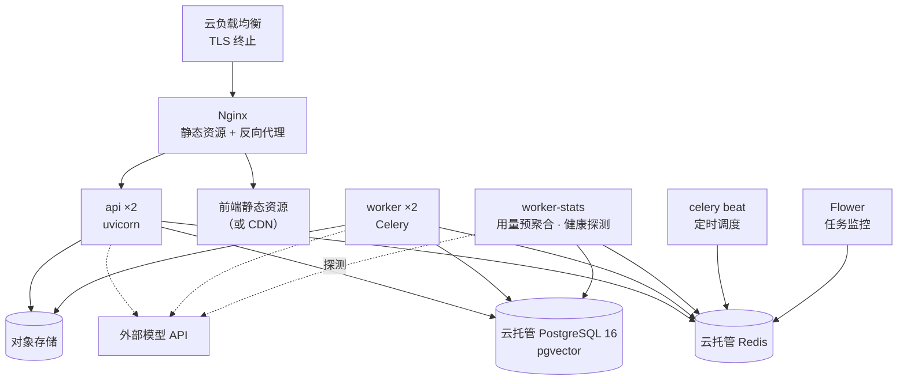

# 05 部署与运维

## 1. 环境划分


| 环境         | 用途        | 数据                   | 模型                        |
| ---------- | --------- | -------------------- | ------------------------- |
| local      | 开发自测      | Docker Compose 起全套依赖 | 可用 Fake Provider，不烧 token |
| staging    | 集成验证、评测回归 | 脱敏样本数据               | 与生产同模型，独立配额               |
| production | 对外服务      | 真实数据                 | 生产 API Key                |


三套环境使用同一份 Compose/Helm 模板，差异只在环境变量与资源规格。**禁止出现只在某个环境存在的代码分支**。

## 2. 代码仓库结构

单仓库（monorepo），后端与前端同仓，避免接口变更时的跨仓协作成本。

```
industry-rag-platform/
├── backend/
│   ├── app/
│   │   ├── main.py                 # FastAPI 装配
│   │   ├── platform/               # 共享层：配置/日志/异常/分页/依赖
│   │   │   ├── config.py
│   │   │   ├── db.py               # 引擎、会话、RLS 注入
│   │   │   ├── llm/                # Provider 抽象与实现
│   │   │   ├── storage/            # S3 客户端与预签名
│   │   │   └── observability/
│   │   ├── modules/
│   │   │   ├── identity/           # router / service / repository / models / schemas
│   │   │   ├── knowledge/
│   │   │   ├── ingestion/
│   │   │   │   ├── parsers/        # pdf / docx / xlsx / ocr
│   │   │   │   ├── chunkers/
│   │   │   │   └── tasks.py        # Celery 任务定义
│   │   │   ├── retrieval/
│   │   │   ├── chat/
│   │   │   ├── profile/
│   │   │   └── modelops/       # 接入点管理 / 用量聚合 / 健康探测
│   │   └── worker.py               # Celery 入口
│   ├── alembic/
│   ├── tests/
│   │   ├── unit/ integration/ e2e/
│   │   └── fixtures/               # 样例文档，含扫描件与复杂表格
│   ├── scripts/
│   │   ├── evaluate.py             # 评测回归
│   │   └── seed.py                 # 内置行业模板初始化
│   └── pyproject.toml
├── frontend/                       # 结构见 03 文档 4.1
├── deploy/
│   ├── docker-compose.yml
│   ├── docker-compose.dev.yml
│   └── helm/                       # 后续 K8s 用
├── docs/
└── .github/workflows/
```

依赖管理用 `uv` + `pyproject.toml`（锁文件 `uv.lock` 入库），前端用 `pnpm`。所有版本锁定，CI 使用 `--frozen-lockfile`。

## 3. 运行时拓扑




### 服务清单与资源规格（生产起步配置）


| 服务           | 副本  | CPU   | 内存     | 说明                                                          |
| ------------ | --- | ----- | ------ | ----------------------------------------------------------- |
| api          | 2   | 1 核   | 2 GB   | uvicorn，每副本 4 worker；主要是 IO 等待                              |
| worker-parse | 2   | 2 核   | 4 GB   | CPU 密集；OCR 时内存峰值高，需设 `--max-tasks-per-child=20` 防泄漏         |
| worker-embed | 1   | 0.5 核 | 1 GB   | 纯 IO 等待，与解析分队列避免互相饿死                                        |
| worker-stats | 1   | 0.5 核 | 512 MB | 用量小时级预聚合、接入点健康探测；独立队列，与业务链路完全解耦                              |
| beat         | 1   | 0.2 核 | 256 MB | 触发预聚合（每小时）、健康探测（每 5 分钟）、清理任务                               |
| nginx        | 1   | 0.5 核 | 512 MB | —                                                           |
| PostgreSQL   | 托管  | 4 核   | 16 GB  | `shared_buffers=4GB`，`maintenance_work_mem=2GB`（建 HNSW 索引用） |
| Redis        | 托管  | —     | 2 GB   | 队列 + 缓存 + 限流                                                |


**解析与嵌入必须分队列**（`-Q parse` / `-Q embed`）。混在一起时，一个大 PDF 的 OCR 会把 worker 占满，导致所有小文档的嵌入任务排队，用户看到的是"所有上传都卡住了"。

## 4. 配置与密钥

配置全部走环境变量，用 Pydantic Settings 强类型解析，启动时校验失败即崩溃（fail fast），不允许带着错误配置半可用地跑起来。

```python
class Settings(BaseSettings):
    database_url: PostgresDsn
    redis_url: RedisDsn
    s3_endpoint: AnyHttpUrl
    s3_bucket: str
    llm_provider: Literal["openai_compatible", "fake"]
    llm_base_url: AnyHttpUrl
    llm_api_key: SecretStr
    llm_model: str
    embedding_model: str
    embedding_dim: int = 1024
    jwt_secret: SecretStr
    environment: Literal["local", "staging", "production"]

    model_config = SettingsConfigDict(env_prefix="IRP_", env_file=".env")
```

密钥管理：

- 生产密钥存于云厂商的密钥管理服务，容器启动时注入，**不进镜像、不进代码仓库、不进日志**。
- 仓库根目录提供 `.env.example`，只含键名和示例值。
- CI 中配置 `gitleaks` 扫描，检出密钥即阻断。
- `SecretStr` 类型保证误打印时输出 `**********`。


## 5. CI/CD


| 阶段       | 内容                                        | 阻断条件            |
| -------- | ----------------------------------------- | --------------- |
| lint     | ruff + mypy（后端），eslint + tsc（前端）          | 任一失败            |
| test     | pytest（单元 + 集成，集成用 testcontainers 起真实 PG） | 失败或后端覆盖率 < 70%  |
| contract | 生成 OpenAPI 并与前端类型比对                       | 类型不一致           |
| secret   | gitleaks                                  | 检出密钥            |
| build    | 多阶段构建镜像，打 tag 为 git sha                   | —               |
| eval     | 触及 RAG 链路的变更跑 `scripts/evaluate.py`       | 核心指标下降 > 2 个百分点 |
| deploy   | staging 自动部署；生产手动审批                       | —               |


数据库迁移作为独立的 Job 在应用启动**前**执行，不放在应用进程里自动 `upgrade head`——多副本同时启动会并发跑迁移。迁移必须向后兼容（先加列、双写、再删列），保证滚动发布期间新旧版本共存可用。

## 6. 可观测性


### 日志

结构化 JSON，字段固定：`ts / level / logger / message / request_id / tenant_id / user_id / duration_ms / error_code`。禁止把文档正文、提示词全文写入日志，只记 hash 与长度。

### 指标（Prometheus 格式，`/metrics`）


| 指标                                     | 类型        | 用途                           |
| -------------------------------------- | --------- | ---------------------------- |
| `irp_http_request_duration_seconds`    | Histogram | 按路由的延迟分布                     |
| `irp_ingestion_stage_duration_seconds` | Histogram | 定位摄取瓶颈在哪个阶段                  |
| `irp_ingestion_failures_total`         | Counter   | 按 `error_code` 分标签           |
| `irp_retrieval_duration_seconds`       | Histogram | 分 vector / fulltext / rerank |
| `irp_llm_tokens_total`                 | Counter   | 按 tenant / purpose           |
| `irp_llm_errors_total`                 | Counter   | 上游可用性                        |
| `irp_no_answer_total`                  | Counter   | 拒答率异常升高是知识覆盖不足的早期信号          |
| `irp_celery_queue_depth`               | Gauge     | 队列积压                         |


### 告警


| 告警        | 阈值             | 级别  |
| --------- | -------------- | --- |
| 摄取失败率     | 5 分钟内 > 20%    | P1  |
| 队列积压      | 持续 10 分钟 > 100 | P2  |
| 问答 P95 延迟 | > 8 s 持续 5 分钟  | P2  |
| 上游模型错误率   | > 10%          | P1  |
| 数据库连接池耗尽  | 使用率 > 90%      | P1  |
| 磁盘使用率     | > 80%          | P2  |


### 链路追踪

OpenTelemetry，`trace_id` 从 HTTP 请求贯穿到 Celery 任务（通过任务参数传递 trace context）。一个文档从上传到可检索的完整链路必须能在一条 trace 中看全，否则排查跨进程问题会非常痛苦。

## 7. 备份与恢复


| 对象         | 策略                              | RPO  | RTO             |
| ---------- | ------------------------------- | ---- | --------------- |
| PostgreSQL | 云托管自动备份，每日全量 + WAL 连续归档，保留 14 天 | 5 分钟 | 1 小时            |
| 对象存储       | 开启版本控制 + 跨区域复制                  | 近实时  | 15 分钟           |
| Redis      | 不备份                             | —    | 队列丢失后由文档状态机重新驱动 |


Redis 不备份是一个明确的设计选择：队列内容可以从 `documents.status != 'ready'` 的记录重新生成。启动时执行一次对账任务，把处于中间态且超过 1 小时未更新的文档重新投递。这比维护 Redis 持久化简单得多，也更可靠。

**恢复演练每季度一次**，从备份恢复到独立环境并验证检索可用。没演练过的备份等于没有备份。

## 8. 容量规划

按 10 万页文档估算：


| 项                | 估算                           |
| ---------------- | ---------------------------- |
| chunk 数          | 10 万页 × 约 2.5 块/页 ≈ 25 万     |
| 向量存储             | 25 万 × 1024 维 × 4 B ≈ 1.0 GB |
| HNSW 索引          | 约为向量的 1.5 倍 ≈ 1.5 GB         |
| 文本与元数据           | 约 2 GB                       |
| `document_pages` | 约 3 GB（含 blocks jsonb）       |
| 数据库总量            | 约 10 GB（含索引与膨胀余量）            |
| 对象存储             | 原始文件约 50 GB                  |


结论：单台 4 核 16 GB 的托管 PostgreSQL 有充足余量，向量全部可驻留内存。此规模下 pgvector 完全够用，引入独立向量库是过度设计。

**扩容触发线**：chunk 数超过 500 万，或向量检索 P95 超过 500 ms 时，重新评估是否迁移到独立向量库。

### 成本构成


| 项         | 占比特征                          |
| --------- | ----------------------------- |
| Embedding | 一次性为主，与文档量成正比；缓存可省 50%+ 的重建成本 |
| 生成        | 持续性主要成本，与问答量 × 上下文长度成正比       |
| 重排        | 开启后与问答量成正比，单价低于生成             |
| 基础设施      | 固定成本，此规模下占比不高                 |


控成本的三个抓手，按性价比排序：控制注入证据的数量（直接线性影响 prompt token）、对高频相同问题做答案缓存、把会话历史压缩为摘要而非全量拼接。

## 9. 上线检查清单

- [ ] 数据库 RLS 策略对所有租户表已启用，且用两个租户账号做过交叉访问验证
- [ ] 对象存储桶为私有，公网直接访问返回 403
- [ ] 所有密钥来自密钥管理服务，镜像中 `grep -r "sk-"` 无命中
- [ ] 限流与配额生效，429 响应带 `Retry-After`
- [ ] 客户端断开时上游 LLM 调用确实被取消（用长回答手动验证）
- [ ] 迁移脚本在 staging 上跑过一次全量恢复演练
- [ ] 告警接入值班渠道，且做过一次真实触发测试
- [ ] 评测基线已存档，指标达到 04 文档第 7 节的目标
- [ ] 内置行业模板已通过 `seed.py` 初始化
- [ ] 上传恶意/超大/损坏文件的边界测试通过，服务未崩溃

---

上一篇：[04 RAG 流水线](./04-rag-pipeline.md) ｜ 下一篇：[06 路线图](./06-roadmap.md)