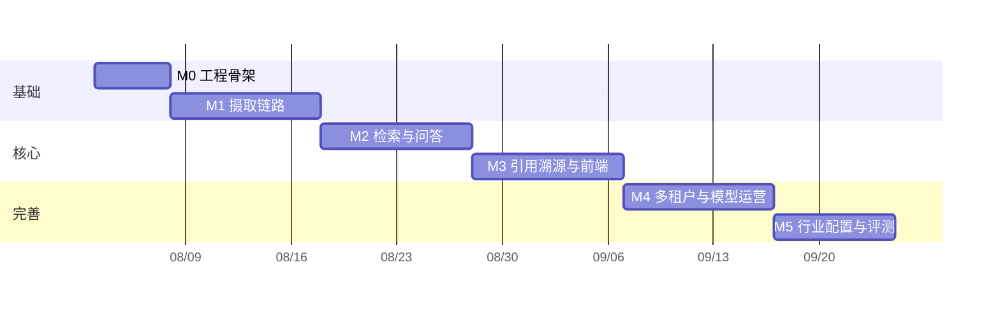

# 06 路线图与风险

## 1. 里程碑总览

按"最短路径打通端到端链路，再逐层加厚"的顺序排列。每个里程碑都必须是**可演示的完整切片**，而不是"这一期只做后端"。

以 2 名后端 + 1 名前端的配置估算，约 9～10 周到达可交付状态。

## 2. 里程碑详情

### M0 · 工程骨架（1 周）

**目标**：任何人 clone 后一条命令跑起全套环境。

交付物：
- monorepo 目录结构、`docker-compose.dev.yml`（PG + pgvector、Redis、MinIO）
- FastAPI 骨架、配置层、日志、异常处理、分页、依赖注入
- Alembic 初始化，建 `tenants` / `users` / `memberships` 三张表
- Provider 抽象层与 Fake 实现
- CI：lint + test + 镜像构建
- 前端骨架：路由、布局、登录页、HTTP 客户端与 SSE 封装

**验收**：`docker compose up` 后访问前端可登录，`/healthz` 返回 200，CI 全绿。

### M1 · 摄取链路（2 周）

**目标**：上传一个 PDF，能在数据库里看到带页码坐标的 chunks。

交付物：
- 知识库与文档的 CRUD、S3 预签名直传
- Celery 接入，parse / embed 双队列
- PDF（文本层）与 DOCX 解析器，输出 `document_pages`
- 页眉页脚剔除、标题层级识别
- 结构感知分块器 + 标题路径前缀
- 真实 Embedding Provider 接入与向量写入
- 摄取状态机、失败重试、SSE 进度推送
- 前端：文档列表、拖拽上传、进度展示、失败原因与重试

**验收**：上传一份 100 页的真实设备手册，5 分钟内状态变为 `ready`，抽查 10 个 chunk 的 `heading_path` 与 `page_start` 均正确。

**风险点**：解析质量是本阶段的主要不确定性，必须用真实客户文档测试，不要用规整的公开 PDF 自欺欺人。

### M2 · 检索与问答（2 周）

**目标**：能问出第一个正确答案。

交付物：
- 向量检索 + 全文检索（含 jieba 分词写入与查询）
- RRF 融合、上下文扩展
- `POST /search` 检索调试接口
- 提示词组装、LLM 流式生成、SSE 事件流
- 会话与消息持久化、引用落库
- 引用编号校验与拒答判定
- 前端：问答界面、流式渲染、证据面板

**验收**：针对 M1 导入的手册提 20 个问题，人工判定至少 16 个回答正确且引用准确。

### M3 · 引用溯源与前端完善（2 周）

**目标**：点击 `[1]` 能跳到原文并高亮。这是本产品区别于"套壳问答"的核心体验。

交付物：
- pdf.js 集成，按 bbox 绘制高亮层与坐标缩放换算
- 文档详情页：左预览 + 右分块列表，双向联动
- 问答页引用角标点击定位
- 会话历史、重新生成、点赞点踩
- XLSX / PPTX / Markdown 解析器补齐
- 扫描件 OCR 链路

**验收**：随机抽 20 条引用，点击后跳转页码正确且高亮区域覆盖引用文本；扫描件手册可正常问答。

### M4 · 多租户、权限与模型运营（2 周）

**目标**：可以放心地让两个客户共用一套系统，并且随时说得清钱花在哪。

交付物：
- RLS 策略全表启用，Celery 任务上下文注入
- 知识库级授权 `kb_grants` 与权限判定服务
- 租户切换、成员管理
- 审计日志
- **大模型接入管理**：接入点 CRUD、凭证只写不读、连通性探测、用途路由与故障转移、`ProviderFactory` 版本化缓存
- **用量统计与可视化**：Redis 缓冲埋点、`llm_usage_hourlies` 小时级预聚合 Worker、成本单价快照、概览/序列/分布三类接口、七张 Recharts 图表的仪表盘
- 限流与配额（配额水位读预聚合表）

**验收**：
- 用两个租户账号做交叉访问测试，所有跨租户请求返回 404；配额耗尽后正确返回 429。
- 停用主接入点后问答自动切到备用，用户无感知。
- 仪表盘在东八区显示的"某一天"用量，与直接查明细表按同一时区聚合的结果完全一致（跨日边界是这里最容易错的地方，必须专门验）。

**说明**：接入点管理其实在 M0 就以环境变量的简化形式存在（见 05 文档第 4 节），M4 做的是把它从"配置文件里的一个模型"升级为"可管理的多个接入点"。这个顺序是刻意的——过早引入接入点管理会让前三个里程碑背上不必要的复杂度。

### M5 · 行业配置与评测体系（1.5 周）

**目标**：新增一个行业不需要改代码。

交付物：
- `industry_profiles` 完整实现与四级配置回退
- 三套内置模板（离散制造、流程工业、通用）与 `seed.py`
- 行业术语表加载、元数据 schema 校验
- 配置管理前端（表单 + JSON 双视图）
- 评测集与 `scripts/evaluate.py`，接入 CI
- 重排 Provider 接入（默认关闭）

**验收**：仅通过配置界面新建一个行业 profile 并绑定知识库，分块与提示词行为按配置改变；评测脚本在 CI 中跑通并产出基线报告。

## 3. 后续演进（M5 之后，需重新评估优先级）

| 方向 | 触发条件 |
| --- | --- |
| 重排常态化开启 | 评测显示 Precision@5 低于 0.80 |
| 知识图谱与图检索 | 出现大量"跨文档关联推理"类问题（如"该型号泵用在哪些产线上"） |
| Agent 工具调用 | 需要接入实时数据（工单系统、设备台账） |
| 图纸多模态理解 | 客户核心资料以图纸为主 |
| 私有化部署包 | 出现内网部署的付费需求 |
| 独立向量库迁移 | chunk 数超 500 万或检索 P95 超 500 ms |

**不要提前做这些**。每一项都会显著增加系统复杂度，而它们的价值完全依赖于基础链路的质量。基础 RAG 答不准的时候加知识图谱，只会得到一个答不准且难以调试的系统。

## 4. 风险登记表

| 编号 | 风险 | 概率 | 影响 | 应对 |
| --- | --- | --- | --- | --- |
| R1 | 工业 PDF 版面复杂（多栏、跨页表格、图文混排），解析质量不达预期 | 高 | 高 | M1 就用真实客户文档做基准；建立 20 份文档的解析回归集；预留版面分析模型（如 PP-StructureV2）作为升级路径 |
| R2 | 中文分词对专业术语切分错误，导致型号类查询召回失败 | 高 | 中 | 行业术语表机制在 M5 前先以配置文件形式落地；排查手册中已列明定位方法 |
| R3 | 外部模型 API 不稳定或限流 | 中 | 高 | Provider 层实现重试、熔断、超时保护；M4 的接入点用途路由提供多厂商故障转移，健康探测每 5 分钟标记不可用节点 |
| R4 | Token 成本超预算 | 中 | 中 | M4 起全量埋点并按写入时单价快照成本；用量仪表盘按模型/用途/用户归因；控制注入证据数量；租户级配额 |
| R5 | 用户期望"什么都能问"，但知识库覆盖不足 | 高 | 中 | 拒答话术引导用户上传资料；拒答率作为知识覆盖度指标持续监控 |
| R6 | 多租户数据泄漏 | 低 | 极高 | RLS + 应用层双重过滤；交叉访问测试进 CI；跨租户一律 404 |
| R7 | 向量模型后期需要更换，全量重算成本高 | 中 | 中 | `index_version` 列在 M1 就预留；Embedding 结果缓存 |
| R8 | 行业配置抽象过度或不足 | 中 | 中 | M5 之前先用两个真实行业验证配置项是否够用，宁可少抽象也不要抽象错 |

R1 是最需要正视的风险。RAG 项目失败的最常见原因不是模型不行，而是解析阶段就已经把信息丢失了，而团队直到后期才发现。因此 M1 的验收标准必须严格执行，不允许"先跑通再说"。

## 5. 待确认的开放问题

| 问题 | 影响的设计 | 需要谁确认 |
| --- | --- | --- |
| 是否需要对接企业 SSO（LDAP / OAuth / 企业微信 / 钉钉） | `identity` 模块的认证方式扩展点 | 产品 / 客户 |
| 首批目标行业具体是哪两个 | 内置模板的优先级与评测集构建 | 产品 |
| 是否有文档密级要求（同一知识库内按密级分权） | 需在 chunk 级增加 `security_level` 并入检索过滤 | 客户合规 |
| 是否需要支持知识库之间的资料引用与复用 | 文档与知识库的关系是否要从一对多改为多对多 | 产品 |
| 回答内容是否会被写入正式文件（检修记录等） | 决定引用快照与不可篡改审计的严格程度 | 客户 |

这些问题不阻塞 M0～M3 的开发，但需要在 M4 之前得到答复。

---

上一篇：[05 部署与运维](./05-deployment.md) ｜ 回到 [文档索引](./README.md)
